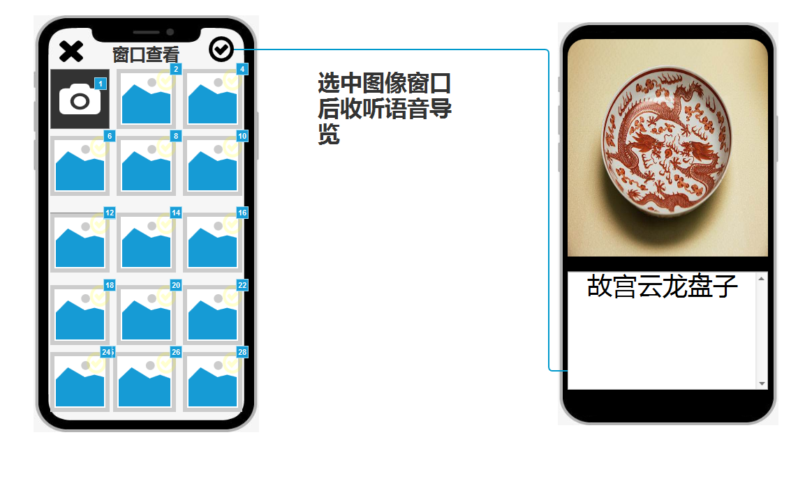
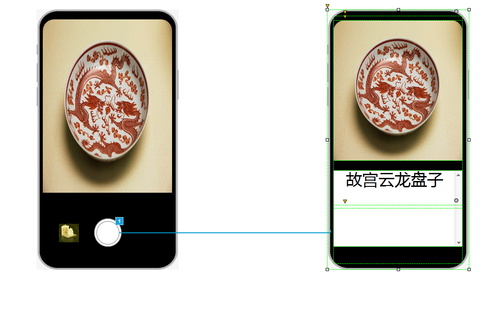

# 博物馆动静皆宜
************
## PRD价值主张设计
### PRD加值宣言（使用场景）
* 每一件展品都不应该“默默无闻”
* 目标用户：来博物馆的游客
### 用户痛点：
（1） 博物馆人手不足，无法为每一位游客讲解，游客无法实时获得每一个想要了解的展品详细信息。
（2） 针对感兴趣的展品，游客难以知晓相似的展品所在位置与数量。
### 功能使用场景描述：

（1）用户来到博物馆，专注于展品，不想阅读繁杂的文字，可使用博物馆app进行语音导览交互将文字转为语音。

（2）当用户在逛展区时，想找到某一相似的展品，不用专门找导览人员，可使用博物馆app进行图像搜索，找到同样或相似的展品并找到展品相应位置及相关信息。
### 优先级：
高–1.图像识别搜索展品，反馈相似展品方位信息。

低–2.语音导览交互把文字转化为语音。

APP内储存了博物馆展品图片及信息，利用图像识别API，我们可以为用户进行展品识别，避免某些展品缺失介绍信息影响游客体验，同时还可以分门别类对用户上传展品图片进行推送，为其介绍类似的展品及所在区域。
### 功能详情
功能一：相似展品介绍及寻找
用户使用APP上传展品图片，识别展品后推送与该展品同类型相似展品所在区域与相关信息
功能二：语音导览 
用户打开语音导览界面，选择需要导览的展品，系统后台语音播报展品相关信息。

### 实现效果
用于进入APP主界面，通过点击“语音导览”和“图像识别”按钮可以实现不同功能：

1.首先点击“图像识别”按钮进入对应界面。用户通过上传展品图片来实现“相似展品搜索”功能；

2.再点击“语音导览”按钮，可在窗口页面选择需要进行语音导览介绍的展品。
# 原型：

